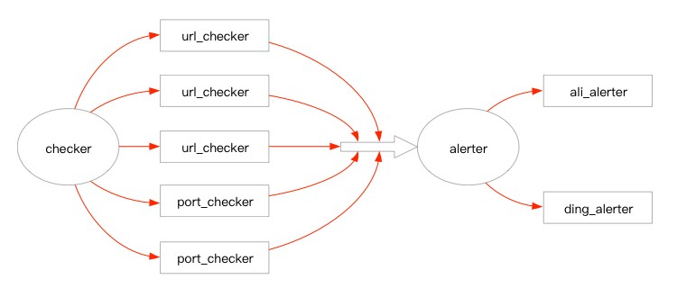

# rotates
进程监控工具，目前支持端口与url返回值监控。

---

## 简介
监控程序可以通过如下两种方法对指定端口进行检查：  
- 端口是否开启监听。  
- 端口执行GET的返回值是否符合指定正则匹配。  

如果端口不符合检查条件，则发起告警。  
目前支持的告警通道为：
- 阿里云语音服务的语音通知接口。
- 钉钉机器人接口。

## 设计
checker  
配置文件中的每一个检查条目都将生成一个对应的 Checkable，
并放入数组中，每次检查都会调用Checkable的Check方法。
- PortChecker  
对指定端口发起net.DialTimeout调用，判断端口是否存在。
- UrlChecker  
对指定端口发起GET请求，判断返回值是否符合正则匹配。

alerter
配置中的每一个告警条目都将生成一个对应的 Sendable，
并放入数组中。一旦接收到告警信息，将对该数组中的所有alert分发告警。
- AliAlert  
调用阿里语音服务的语音通知接口，拨打指定电话。
- DingAlert
调用钉钉机器人的rest接口，向指定钉钉群推送告警。  



## 使用
### 源码目录结构
```text
conf/config.toml.template # 默认配置文件模板。
deps/ # 存放依赖包。
deps/get_deps.sh # 用于下载依赖。
main/ # 存放项目源码。
scripts/rotates.sh # rotates的启停脚本。
pack.sh # 项目编译打包脚本。
```
### 编译
```text
pack.sh
```
### 部署
```text
cp rotates.tar.gz /path/to/deploy
cd /path/to/deploy; tar zxvf rotates.tar.gz
```
部署目录结构
```text
bin/rotates.sh # 启停脚本。
conf/config.toml.template # 配置文件模板。
lib/rotates # go的二进制执行包。
logs/ # 日志目录。
```
### 修改配置
修改配置文件 config.toml.template 为 config.toml  
模板配置文件示例。
```text
[service]
    port = 9999    # rotates的rest端口，返回"ok"字符串，用于自身的存活监控。
    interval = 60   # 检查间隔。
    suppression_time = 900    # 两次告警的告警间隔，单位秒。
    alert_times = 3   # 连续告警最大次数，连续报警超过该次数将停止报警，直到报警恢复。

[alerts]
    [[alerts.dings]]
        name = "钉钉群机器人"
        token = "https://oapi.dingtalk.com/robot/send?access_token=abcsometokenabc"
        at_all = false
        at = [12345678901,]
    [[alerts.alis]]
        name = "阿里语音通知接口"
        key = "keykeykey"
        secret = "secsecsec"
        show_number = "12345678901"
        called_numbers = ["12345678901"]
        tts_code = "TTS_12345678"
        params = { "name" = "", "message" = "problems"}

[checks]
    urls = [
        {name="service1", url="http://host1:20001/health", expect="ok"},
        {name="service2", url="http://host2:20002/health", expect="ok"},
        {name="service3", url="http://host3:20003/health", expect="ok"},
    ]
    ports = [
        {name="prog1", host="host1", port=10001},
        {name="prog2", host="host2", port=10002},
        {name="prog3", host="host2", port=10003},
    ]
```
### 启停
```text
bin/rotates.sh start # 启动，并显示pid。如进程已存在，则只显示当前pid。
bin/rotates.sh status # 检查当前进程是否存在，并显示pid。
bin/rotates.sh stop # 停止，并显示停止进程的pid。
```
### 状态接口
访问配置文件中的 service.port 端口，返回 ok，则说明进程存在。
目前状态接口尚未添加其他状态信息。